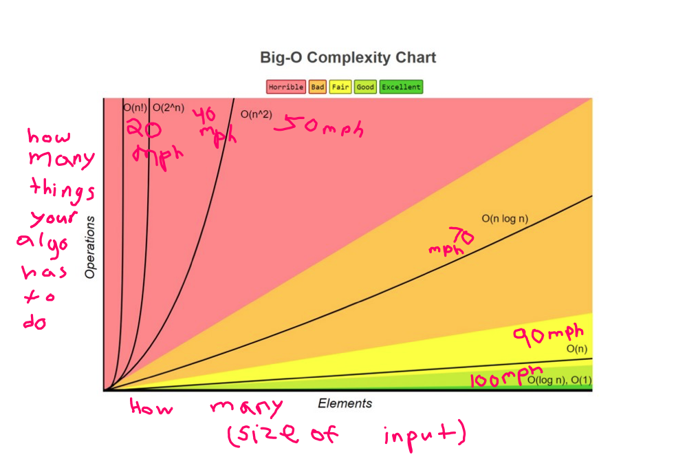
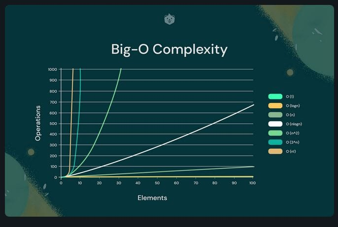
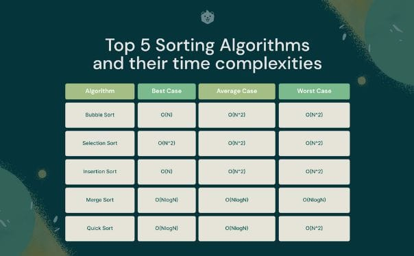

# Algorithms and Data Structures 🥇

## Basic Rules
✅ **"When writing algorithms, time complexity and memory (space) are in balance"**  
✅ **"We use asymptotic notation to exclude less important cases, and ust focuses on running time"**

  

## Running Time Rules (fastest(1) to slower(6)) (VARIES DEPENDING ON THE INPUT) ⏩
1. Constant functions `37`
2. Logarithmic functions `log n`
   - When an algorithm decreases the magnitude of its input size each time.
   - Time increases lineary, while input(n) exponentially. (10 = 1s) (100 - 2s) (10000 - 4s)
   - At each iteration array is halved
4. Linear functions `37n`
5. Linearithmic functions `n log n`
6. Polynomial functions `n^37`
7. Exponential functions `37^n` (AVOID USING THIS ONE)

  

## Searching 🔎
> **Binary Search:** 
> - **_Complexity: (Running Time/Asymptotic Notation)_** 
>   - O(log n) 
>   - Ω(1)
> - **_Space Complexty:_** 
>   - O(1)
> - **_Explanation:_**
>   - `Partions array into halves each iteration`

## Sorting 🔀

  

> **Binary Sort:** 
> - **_Complexity:_** 
>   - Θ(nlogn) 
>   - O(nlogn) 
>   - Ω(n)
> - **_Space Complexty:_** 
>   - O(n) No other varieble than themporary is required

> **Selection Sort:** 
> - **_Complexity:_** 
>   - Θ(n^2) All cases regardless of the input (Nested Loops)
> - **_Space Complexty:_** 
>   - O(1)
> - **_Explanation:_**
>   - `This algorithm is called selection sort because it repeatedly selects the next-smallest element and swaps it into place.`

> **Quicksort:**
> - **_Complexity:_** 
>   - Θ(nlogn) 
>   - O(nlogn) 
>   - Ω(n)
> - **_Space Complexty:_** 
>   - (edit here)

> **Merge Sort:**
> - **_Complexity:_** 
>   - (edit here)
> - **_Space Complexty:_** 
>   - (edit here)
> - **_Explanation:_**
>   - `Partions array into halves and merges two halves in linear time.`
